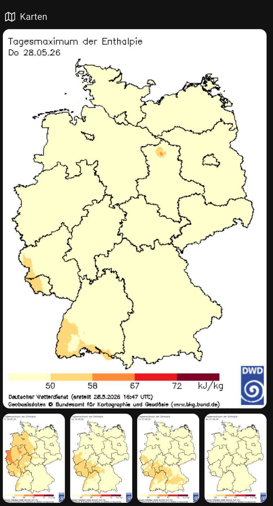
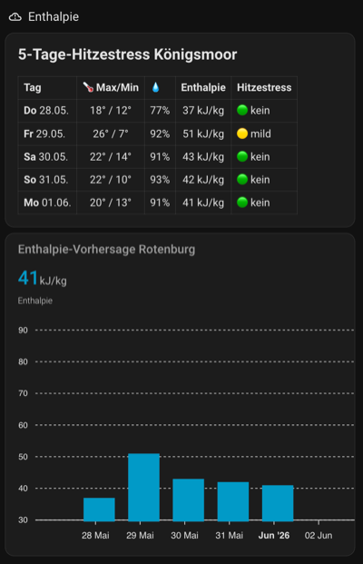

# DWD Enthalpie (Hitzestress) für Home Assistant

[](https://hacs.xyz/docs/faq/custom_repositories)

Home Assistant Custom Integration für den **Enthalpie-Index (Hitzestress für Hühner)**
des Deutschen Wetterdienstes (DWD).

Quelle: <https://www.wettergefahren.de/warnungen/indizes_landwirtschaft/enthalpie.html>

## Was ist Enthalpie / Hitzestress?

Der DWD veröffentlicht für rund 600 deutsche Wetterstationen täglich das prognostizierte
**Tagesmaximum der Enthalpie** (in kJ/kg) für heute + 4 Folgetage. Aus diesem Wert
leitet der DWD eine Hitzestress-Klasse ab — relevant vor allem für die Geflügelhaltung:

| Enthalpie (kJ/kg) | Klasse                  |
| ----------------- | ----------------------- |
| < 50              | kein Hitzestress        |
| 50 – < 58         | milder Hitzestress      |
| 58 – < 67         | mäßiger Hitzestress     |
| 67 – < 72         | starker Hitzestress     |
| ≥ 72              | extremer Hitzestress    |

## Funktionsumfang

### Stationssensoren (pro konfigurierter Station)

- 📍 **Stationsauswahl per UI** — erst Bundesland, dann Station aus Dropdown
- 🏠 **Mehrere Stationen** pro Installation (z. B. Heimatort + Stallstandort)
- 📊 **Pro Station zwei Sensoren**:
  - `sensor.dwd_enthalpie_<station>_enthalpie` — numerischer Wert in kJ/kg, inkl. `forecast`-Attribut (5 Tage)
  - `sensor.dwd_enthalpie_<station>_hitzestress` — Hitzestress-Klasse als `enum`-Sensor, inkl. `forecast_classes`-Attribut
- 🕐 **`last_fetch`-Attribut** am Enthalpie-Sensor — zeigt, wann die Daten zuletzt erfolgreich abgerufen wurden

### Deutschlandkarten (Gerät „DWD Enthalpie Karten")

- 🗺️ **5 Image-Entities** — die DWD-Prognosekarten für heute + 4 Folgetage:

  | Entity | Zeitraum |
  |---|---|
  | `image.dwd_enthalpie_map_today` | heute |
  | `image.dwd_enthalpie_map_day1` | morgen |
  | `image.dwd_enthalpie_map_day2` | übermorgen |
  | `image.dwd_enthalpie_map_day3` | 3. Folgetag |
  | `image.dwd_enthalpie_map_day4` | 4. Folgetag |

- 🎬 **Kamera-Entity `camera.dwd_enthalpie_vorhersage_animation`** — zeigt die 5 Karten als animierten Loop (~0,75 s pro Karte) im Live-View einer Camera-Karte

### Allgemein

- 🌐 **Mehrsprachig** — Deutsch und Englisch
- 🔁 **Ein HTTP-Request für alle Stationen** — schont den DWD-Server
- 🔄 **Optionen-Flow** — Stationen nachträglich hinzufügen / entfernen

## Installation

### Via HACS (empfohlen)

1. HACS → Integrationen → Drei-Punkte-Menü → „Custom repositories"
2. URL dieses Repos eintragen, Kategorie „Integration"
3. „DWD Enthalpie (Hitzestress)" installieren
4. Home Assistant neu starten
5. Einstellungen → Geräte & Dienste → „Integration hinzufügen" → „DWD Enthalpie"

### Manuell

1. Den Ordner `custom_components/dwd_enthalpie/` in dein Home-Assistant-`config/`-
   Verzeichnis kopieren (Endstruktur: `config/custom_components/dwd_enthalpie/…`)
2. Home Assistant neu starten
3. Integration über die UI hinzufügen

## Konfiguration

Komplett über die UI. Beim Hinzufügen:

1. **Bundesland wählen** (16 Optionen)
2. **Station wählen** aus dem Dropdown der Stationen in diesem Bundesland
3. Optional Häkchen „Weitere Station hinzufügen" → zurück zu Schritt 1
4. Fertig — pro Station erscheint ein Gerät mit zwei Entitäten

Die Deutschlandkarten erscheinen automatisch als eigenes Gerät, unabhängig von der Stationsauswahl.

Nachträgliche Änderungen über „Konfigurieren" auf der Integrationskachel.

## Lovelace-Beispiele

### Prognosekarten



Heute groß, die vier Folgetage als Miniaturansicht darunter:

```yaml
type: grid
cards:
  - type: heading
    heading: Karten
    heading_style: title
    icon: ios:map
  - type: picture
    image_entity: image.dwd_enthalpie_karten_heute
  - type: horizontal-stack
    cards:
      - type: picture
        image_entity: image.dwd_enthalpie_karten_morgen
      - type: picture
        image_entity: image.dwd_enthalpie_karten_ubermorgen
      - type: picture
        image_entity: image.dwd_enthalpie_karten_3_folgetag
      - type: picture
        image_entity: image.dwd_enthalpie_karten_4_folgetag
    grid_options:
      columns: 18
      rows: auto
```

### Animierter Karten-Loop

```yaml
type: picture-glance
title: Enthalpie-Vorhersage
camera_image: camera.dwd_enthalpie_vorhersage_animation
entities: []
```

### 5-Tage-Tabelle & apexcharts-Kurve



Die Kurve zeigt die Hitzestress-Schwellenwerte als farbige Zonen; die Tabelle
kombiniert Enthalpie-Werte mit Wetterdaten aus einer eigenen Template-Entität
(`sensor.hitzestress_forecast_<station>`, die `rows` mit `date`, `stress`,
`temp`, `templow`, `humidity` und `enthalpie` liefert):

```yaml
type: grid
cards:
  - type: heading
    heading: Enthalpie
    heading_style: title
    icon: mdi:weather-cloudy-alert
  - type: markdown
    content: >-
      

        ## 5-Tage-Hitzestress Königsmoor

        | Tag | 🌡️ Max/Min | 💧 | Enthalpie | Hitzestress |
        |:--|:--:|:--:|:--:|:--|
        
        {%- set d = strptime(r.date, '%Y-%m-%d') -%}
        
        
        | **{{ wd }}** {{ d.strftime('%d.%m.') }} | {{ r.temp | round(0) }}° / {{ r.templow | round(0) }}° | {{ r.humidity | round(0) }}% | {{ r.enthalpie | round(0) }} kJ/kg | {{ dot }} {{ r.stress }} |
        
  - type: custom:apexcharts-card
    header:
      show: true
      title: Enthalpie-Vorhersage Rotenburg
      show_states: true
      colorize_states: true
    graph_span: 5d
    span:
      start: day
    yaxis:
      - min: 30
        max: 90
        apex_config:
          tickAmount: 6
          annotations:
            yaxis:
              - "y": 50
                y2: 58
                fillColor: "#FAC775"
                opacity: 0.15
                label:
                  text: mild
                  style:
                    fontSize: 10px
              - "y": 58
                y2: 67
                fillColor: "#EF9F27"
                opacity: 0.15
                label:
                  text: mäßig
                  style:
                    fontSize: 10px
              - "y": 67
                y2: 72
                fillColor: "#E24B4A"
                opacity: 0.15
                label:
                  text: stark
                  style:
                    fontSize: 10px
              - "y": 72
                y2: 90
                fillColor: "#7F77DD"
                opacity: 0.15
                label:
                  text: extrem
                  style:
                    fontSize: 10px
    series:
      - entity: sensor.dwd_enthalpie_rotenburg_wumme_enthalpie
        name: Enthalpie
        type: column
        color: var(--primary-color)
        data_generator: |
          return entity.attributes.forecast.map((f) => [
            new Date(f.date).getTime(), f.value
          ]);
```

### Beispiel-Automation

```yaml
automation:
  - alias: "Stallventilation bei Hitzestress"
    trigger:
      - platform: state
        entity_id: sensor.dwd_enthalpie_rotenburg_wumme_hitzestress
        to:
          - "severe_heat_stress"
          - "extreme_heat_stress"
    action:
      - service: switch.turn_on
        target:
          entity_id: switch.stallventilator
      - service: notify.mobile_app_handy
        data:
          title: "Hitzestress-Warnung"
          message: >
            {{ states('sensor.dwd_enthalpie_rotenburg_wumme_enthalpie') }} kJ/kg
            in Rotenburg/Wümme – Stallventilation aktiviert.
```

## Datenquelle & Lizenz

- **Daten**: Deutscher Wetterdienst (DWD), CC BY 4.0 — Attribution erfolgt automatisch
  über das `attribution`-Feld jedes Sensors.
- **Code**: MIT License — siehe [LICENSE](LICENSE).

## Disclaimer

Diese Integration ist ein inoffizielles Hobbyprojekt und steht in keinem Zusammenhang
mit dem Deutschen Wetterdienst. Die Werte werden 1× pro Stunde abgerufen — der DWD
aktualisiert die Prognose typischerweise einmal täglich.

## Beitragen

PRs willkommen — insbesondere wenn der DWD die Stationsliste ändert.
Die Stations-Tabelle steht in [`const.py`](custom_components/dwd_enthalpie/const.py).

## KI-Hinweis

Teile dieser Integration — darunter Code, Dokumentation und Konfigurationsbeispiele — wurden
mithilfe von [Claude](https://claude.ai) (Anthropic) entwickelt und überarbeitet.

## Verwandte Indizes

Der DWD veröffentlicht weitere landwirtschaftliche Warnindizes
([Bodenfrost](https://www.wettergefahren.de/warnungen/indizes_landwirtschaft/bodenfrost.html),
[Clomazone](https://www.wettergefahren.de/warnungen/indizes_landwirtschaft/clomazone.html)).
Diese könnten in einer späteren Version ergänzt werden — Issues / PRs willkommen.
